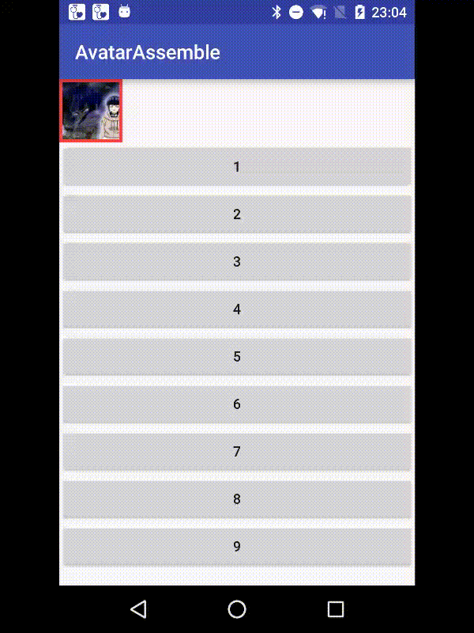

#AvatarAssemble
仿微信群组头像，可设置1到9个头像的链接或者手动添加1到9个ImageView，设置后自动按照规则排列头像（和微信一样）。如果设置的头像链接数量超过9个，则取前9个。


## Notice
1.`MultiAvatarView通过自定义属性mav_size来设置大小，代码会自动根据整体的大小来调整包含的每个头像的大小，不会对MultiAvatarView和ImageView的wrap_content,match_patent属性进行处理。`

2.`可以通过设置mav_padding来修改padding，通过设置mav_divider_size来修改头像间的间隔`

3.`如果需要定制头像间隔的颜色，则直接设置MultiAvatarView的background即可`

## Usage
#### Gradle
使用AndroidStudio引入的方式(目前没有jcenter，可自行使用jitpack)

```groovy
repositories {
    jcenter()
    maven { url "https://jitpack.io" }
}

dependencies {
    compile ''
}
```
## 方式一
(通过代码设置图片的链接)
### layout
 ```xml
 <im.hua.avatarassemble.library.MultiAvatarView
            android:id="@+id/multiAvatarView"
            android:layout_width="wrap_content"
            android:layout_height="wrap_content"
            app:mav_padding="3dp"
            app:mav_divider_size="1dp"
            app:mav_size="64dp"
            android:background="@android:color/holo_red_light"/>
 ```
### java
 ``` java
 List<String> avatarts = new ArrayList<>();
 MultiAvatarView multiAvatarView;
 multiAvatarView.setAvatarUrls(avatarts);
 ```
 
## 方式二
(直接在布局文件中添加头像或者在代码中通过addView来添加头像的ImageView)

`只能添加ImageView作为子View`

```xml
	<im.hua.avatarassemble.library.MultiAvatarView
            android:id="@+id/multiAvatarView"
            android:layout_width="wrap_content"
            android:layout_height="wrap_content"
            app:mav_padding="3dp"
            app:mav_divider_size="1dp"
            app:mav_size="64dp"
            android:background="@android:color/holo_red_light">
            <ImageView
                android:layout_width="wrap_content"
                android:layout_height="wrap_content"
                android:src="@mipmap/ic_launcher"/>
            <ImageView
                android:layout_width="wrap_content"
                android:layout_height="wrap_content"
                android:src="@mipmap/ic_launcher"/>
            <ImageView
                android:layout_width="wrap_content"
                android:layout_height="wrap_content"
                android:src="@mipmap/ic_launcher"/>
        </im.hua.avatarassemble.library.MultiAvatarView>
```
## Attributes

属性名 | 类型 | 含义
-------|------|-----
mav_size | dimension|头像组件大小
mav_padding | dimension|头像组件padding
mav_divider_size | dimension|各个小头像间的间隔

## License
    Copyright 2015-2019 mzhua

    Licensed under the Apache License, Version 2.0 (the "License");
    you may not use this file except in compliance with the License.
    You may obtain a copy of the License at

       http://www.apache.org/licenses/LICENSE-2.0

    Unless required by applicable law or agreed to in writing, software
    distributed under the License is distributed on an "AS IS" BASIS,
    WITHOUT WARRANTIES OR CONDITIONS OF ANY KIND, either express or implied.
    See the License for the specific language governing permissions and
    limitations under the License.
